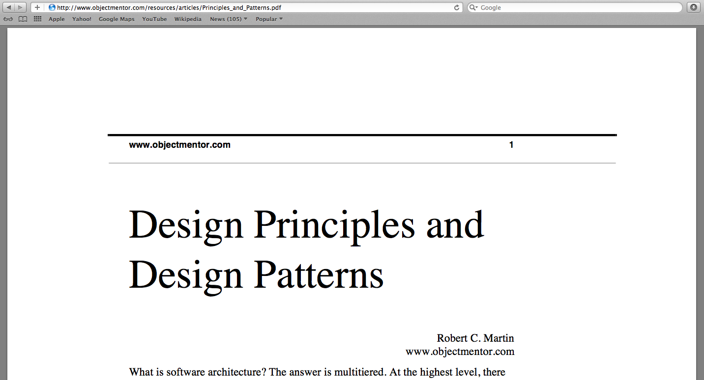

# Better Ruby

!SLIDE

# Better Ruby 
## Through Design Principles*

### Mike Gehard
### [@mikegehard](https://twitter.com/#!/mikegehard)

##### * Bonus points to anyone who can name the musical reference

!SLIDE


!SLIDE bottom-left

# Tech Lead - User Acquisition

}}} images/livingsocial.png

!SLIDE

# "Nothing endures but change." 
#### Heraclitus of Ephesus (c.535 BC - 475 BC)


!SLIDE
#That's great but how does that apply to Ruby?

!SLIDE
#When did you last build an application that didn't change?

!NOTES
  * Apps change because their requirements change
  * If your requirements have never changed then you can stop listening now.

!SLIDE
# How is your app going to adjust to change?

!SLIDE 


!SLIDE

}}} images/remodelChurch.jpg


!SLIDE

#What decides how your app is going to withstand change?

!SLIDE bottom-left

# The design

}}} images/design.jpg::span112::flickr::http://www.flickr.com/people/span112/

!SLIDE


[http://martinfowler.com/bliki/DesignStaminaHypothesis.html](http://martinfowler.com/bliki/DesignStaminaHypothesis.html)

!NOTES
  * There is an inflection point where doing design makes money sense.


!SLIDE bottom-left
# I'm using Rails so I don't need to do design.

}}} images/rails.png

!SLIDE

``` ruby
class Post < ActiveRecord::Base

  has_many :comments
  belongs_to :author

  after_update :alert_updated

  def approve!
    update_attribute(:approved, true)
  end

  def attribute_to(user)
    update_attribute(:author, user)
  end

  def add_comment(comment_text)
    comments << Comment.new(:text => comment_text)
  end

  private
  def alert_updated
  # tell everyone that the post was updated
    # and what changed via email
  end

  # only 100 more lines of code if you are lucky
  # and you have a lot more classes that look like this

end
```

!NOTES
  * Even when using a framework, you still need to design your business logic.


!SLIDE
#How do you measure the design of your application?

!SLIDE bottom-left
#The interactions between classes (aka dependencies)

}}} images/bonds.jpg::emsl::flickr::http://www.flickr.com/people/emsl/

!NOTES
  * As a class, who do I rely on to get my work done and who relies on me to 
get their work done.

!SLIDE



!NOTES
  * Yes this was originally done in Java
  * Ideas still apply to Ruby


!SLIDE
#SOLID
  * Single Responsibility Principle
  * Open/Closed Principle
  * Liskov Substitution Principle
  * Interface Segregation Principle
  * Dependency Inversion Principle

!NOTES
 Way to objectively judge quality of software

!SLIDE
#Single Responsibiliy Principle
### A class should have one, and only one, reason to change.

!SLIDE
#Open/Closed Principle
### You should be able to extend a classes behavior, without modifying it.

!SLIDE
#Liskov Substitution Principle
### Derived classes must be substitutable for their base classes.

!SLIDE
# Interface Segregation Principle
### Make fine grained interfaces that are client specific.


!SLIDE
#Dependency Inversion Principle 
### Depend on abstractions, not on concretions.

!NOTES
  * In Ruby you build to an protocol/contract


!SLIDE
#Other design principles

!SLIDE
#Law of Demter
## More a code smell than a specific design principle

!SLIDE bottom-left

#your mileage may vary
 

}}} images/mileage.jpg::kennejima::flickr::http://www.flickr.com/people/kennejima/

!NOTES

 * Design principles are not hard and fast rules
 * Give you guidance when writing code
 * Some principles may conflict with each other in some situations
 * Use your best judgement

!SLIDE bottom-left
#Thank you. Any questions?

}}} images/thankYou.jpg::27282406@N03::flickr::http://www.flickr.com/people/27282406@N03/

!SLIDE
#Resources
  * [http://www.objectmentor.com/resources/articles/Principles_and_Patterns.pdf](http://www.objectmentor.com/resources/articles/Principles_and_Patterns.pdf)
  * [http://www.butunclebob.com/ArticleS.UncleBob.PrinciplesOfOod](http://www.butunclebob.com/ArticleS.UncleBob.PrinciplesOfOod)
  * [http://confreaks.com/videos/240-goruco2009-solid-object-oriented-design](http://confreaks.com/videos/240-goruco2009-solid-object-oriented-design)
  * [http://confreaks.com/videos/185-rubyconf2009-solid-ruby](http://confreaks.com/videos/185-rubyconf2009-solid-ruby)
  * [http://blog.rubybestpractices.com/posts/gregory/055-issue-23-solid-design.html](http://blog.rubybestpractices.com/posts/gregory/055-issue-23-solid-design.html)
  * [http://mmiika.wordpress.com/oo-design-principles/](http://mmiika.wordpress.com/oo-design-principles/)
